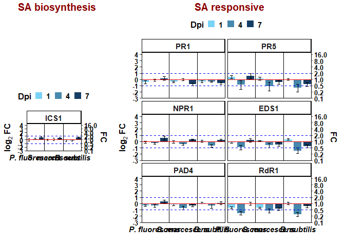
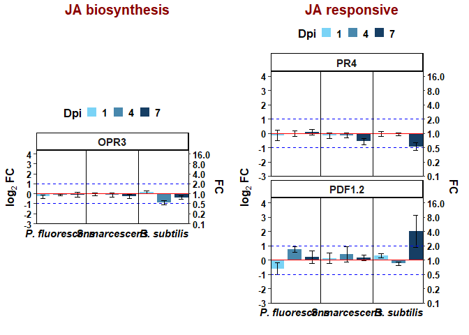

## Library used

``` r
library(tidyverse)
```

    ## ── Attaching core tidyverse packages ──────────────────────── tidyverse 2.0.0 ──
    ## ✔ dplyr     1.1.4     ✔ readr     2.1.5
    ## ✔ forcats   1.0.0     ✔ stringr   1.5.1
    ## ✔ ggplot2   3.5.1     ✔ tibble    3.2.1
    ## ✔ lubridate 1.9.4     ✔ tidyr     1.3.1
    ## ✔ purrr     1.0.2     
    ## ── Conflicts ────────────────────────────────────────── tidyverse_conflicts() ──
    ## ✖ dplyr::filter() masks stats::filter()
    ## ✖ dplyr::lag()    masks stats::lag()
    ## ℹ Use the conflicted package (<http://conflicted.r-lib.org/>) to force all conflicts to become errors

``` r
library(ggplot2)
library(agricolae)
library(tidyr)
library(ggpubr)
library(multcomp)
```

    ## Loading required package: mvtnorm
    ## Loading required package: survival
    ## Loading required package: TH.data
    ## Loading required package: MASS
    ## 
    ## Attaching package: 'MASS'
    ## 
    ## The following object is masked from 'package:dplyr':
    ## 
    ##     select
    ## 
    ## 
    ## Attaching package: 'TH.data'
    ## 
    ## The following object is masked from 'package:MASS':
    ## 
    ##     geyser

``` r
library(emmeans)
```

    ## Welcome to emmeans.
    ## Caution: You lose important information if you filter this package's results.
    ## See '? untidy'

``` r
library(multcompView)
library(dplyr)
```

## Load the data

``` r
rep<-read.csv("Data-obj2-New/Nb_PGPR_New_Combine.csv", na.strings="na")
head(rep)
```

    ##             PGPR Dpi Rep Gene    Cq
    ## 1 P. fluorescens   1   1  PR1 28.67
    ## 2 P. fluorescens   1   2  PR1 28.20
    ## 3 P. fluorescens   1   3  PR1 28.39
    ## 4 P. fluorescens   1   1  PR4 29.02
    ## 5 P. fluorescens   1   2  PR4 30.33
    ## 6 P. fluorescens   1   3  PR4 28.59

``` r
str(rep)
```

    ## 'data.frame':    1188 obs. of  5 variables:
    ##  $ PGPR: chr  "P. fluorescens" "P. fluorescens" "P. fluorescens" "P. fluorescens" ...
    ##  $ Dpi : int  1 1 1 1 1 1 1 1 1 1 ...
    ##  $ Rep : int  1 2 3 1 2 3 1 2 3 1 ...
    ##  $ Gene: chr  "PR1" "PR1" "PR1" "PR4" ...
    ##  $ Cq  : num  28.7 28.2 28.4 29 30.3 ...

``` r
summary(rep)
```

    ##      PGPR                Dpi         Rep        Gene                 Cq       
    ##  Length:1188        Min.   :1   Min.   :1   Length:1188        Min.   :18.41  
    ##  Class :character   1st Qu.:1   1st Qu.:3   Class :character   1st Qu.:25.24  
    ##  Mode  :character   Median :4   Median :5   Mode  :character   Median :26.46  
    ##                     Mean   :4   Mean   :5                      Mean   :26.20  
    ##                     3rd Qu.:7   3rd Qu.:7                      3rd Qu.:27.60  
    ##                     Max.   :7   Max.   :9                      Max.   :36.64

\##Make the factor variable

``` r
rep$PGPR<-factor(rep$PGPR, levels=c("P. fluorescens", "S. marcescens","B. subtilis", "Control"))
rep$Dpi<-as.factor(rep$Dpi)
rep$Gene<-as.factor(rep$Gene)
```

## ΔCt

``` r
ubq_values<-rep %>% 
filter(Gene == "UBQ") %>% # Extract UBQ Cq values for each sample, because UBQ is our reference gene.
pivot_wider(values_from = Cq, names_from=Gene) # pivot_wider() converts long format → wide format so that each row has a UBQ column.
rep_dct <- rep %>%
  filter(Gene != "UBQ") %>% # Remove UBQ rows (because we only calculate ΔCt for target genes)
  left_join(ubq_values, by = c("PGPR", "Dpi", "Rep")) %>% # Join UBQ values using PGPR, Dpi, and Rep as matching variables
  mutate(DeltaCt = Cq - UBQ) # Create a new DeltaCt column: Ct(gene) – Ct(UBQ)
```

## ΔΔCt and fold change

``` r
control_dct <- filter(rep_dct,PGPR == "Control") %>%  # Extract only the Control samples from the ΔCt table
pivot_wider(values_from=DeltaCt, names_from=PGPR) %>% # Reshape so that Control ΔCt becomes its own column
  # values_from = DeltaCt → the ΔCt values for control
  # names_from = PGPR → column will be named "Control"
left_join(rep_dct, control_dct, by=c("Gene", "Dpi", "Rep"))
  
# Calculate ΔΔCt, fold change (FC), and log2FC

Relative_expression<-mutate(control_dct, DeltaDeltaCt = DeltaCt - Control) %>% 
mutate(FC = 2^(-DeltaDeltaCt)) %>% 
  mutate(log2FC=log2(FC))
Relative_expression<-Relative_expression %>% 
dplyr::select(PGPR, Gene, Dpi,Rep,log2FC, FC) # Select the final columns for output
```

## Mean fold change

``` r
summary_df <- Relative_expression %>%
  group_by(PGPR, Dpi, Gene) %>% # Group by treatment, time point, and gene
  filter(PGPR!="Control") %>% 
  summarise(
    MeanFC = mean(FC, na.rm = TRUE), # Mean fold change across replicates
    Meanlog2FC=mean(log2FC,na.rm = TRUE), # Mean log2 fold change
    SE_FC = sd(FC, na.rm = TRUE) / sqrt(n()), # Standard error of FC
    SE_log2FC=sd(log2FC,na.rm = TRUE) / sqrt(n()), # S# Standard error of log2FC
    .groups = "drop" # Ungroup after summarising
  )
```

## Plot

``` r
# Function to plot a gene

library(ggplot2)
library(dplyr)

blue_gradient <- colorRampPalette(c("#7AD3F6", "#163E64"))(3)

plot_gene_expression <- function(df, gene_subset = NULL,
                                 gene_order = NULL, pgpr_order = NULL) {
  df <- df %>%
    filter(PGPR != "Control") %>%
    mutate(
      Dpi = factor(Dpi, levels = c("1", "4", "7")),
      Gene = if (!is.null(gene_order)) factor(Gene, levels = gene_order) else Gene,
      PGPR = if (!is.null(pgpr_order)) factor(PGPR, levels = pgpr_order) else PGPR,
      lower = Meanlog2FC - SE_log2FC,
      upper = Meanlog2FC + SE_log2FC
    )

  if (!is.null(gene_subset)) df <- df %>% filter(Gene %in% gene_subset)

  y_limits <- c(-3, 4)
  num_pgpr <- length(unique(df$PGPR))
  num_dpi  <- length(unique(df$Dpi))

  ggplot(df, aes(x = PGPR, y = Meanlog2FC, fill = Dpi)) +
    geom_col(position = position_dodge(width = 1), width = 0.8) +
    geom_errorbar(
      aes(ymin = lower, ymax = upper),
      width = 0.3,
      position = position_dodge(width = 1)
    ) +
    # Red baseline only
    geom_hline(yintercept = 0, color = "red", linewidth = 0.5) +
    geom_hline(yintercept = 1, color = "blue", linetype = "dashed", size = 0.6) +
    geom_hline(yintercept = -1, color = "blue", linetype = "dashed", size = 0.6) +
    # Facet each gene separately
    facet_wrap(~ Gene, scales = "free_x", nrow = 1) +
        geom_vline(
      xintercept = seq(1.5, num_pgpr - 0.05, by = 1),
      color = "black", linewidth = 0.6
    ) +
    scale_fill_manual(values = blue_gradient, name = "Dpi") +
    scale_y_continuous(
      limits = y_limits,
      breaks = seq(y_limits[1], y_limits[2], by = 1),
      name = expression(bold(log[2] ~ FC)),
      sec.axis = sec_axis(
        trans = ~2^(.),
        breaks = 2^(seq(y_limits[1], y_limits[2], by = 1)),
        labels = function(x) formatC(x, format = "f", digits = 1),
        name = "FC"
      ),
      expand = expansion(mult = c(0, 0.05))
    ) +
    scale_x_discrete(expand=c(0.05,0.05))+
    labs(x = "", y = expression(bold(log[2] ~ FC))) +
    theme_classic() +
    theme(
      legend.position = "top",
      legend.key.size = unit(0.4, "cm"),
      legend.title = element_text(size = 12, face = "bold"),
      legend.text = element_text(size = 11, face = "bold"),
      axis.text.x = element_text(
        color = "black", face = "bold.italic", size = 11,
        hjust = 0.5
      ),
      axis.text.y = element_text(color = "black", face = "bold", size = 10),
      axis.title.y = element_text(face = "bold", size = 12),
      axis.ticks.x= element_blank(),
      axis.ticks.y= element_blank(),
      strip.text = element_text(face = "bold", size = 11),
      panel.border = element_rect(color = "black", fill = NA, linewidth = 0.6),
      axis.line = element_line(color = "black"),
      plot.margin = margin(5, 10, 5, 5),
      panel.spacing = unit(0.3, "lines")
      
    )
}
```

### PR1

``` r
PR1<-plot_gene_expression(df = summary_df,
  gene_subset = c("PR1"),
 gene_order = c("PR1"),
  pgpr_order = c("P. fluorescens", "S. marcescens", "B. subtilis")
)
```

    ## Warning: Using `size` aesthetic for lines was deprecated in ggplot2 3.4.0.
    ## ℹ Please use `linewidth` instead.
    ## This warning is displayed once every 8 hours.
    ## Call `lifecycle::last_lifecycle_warnings()` to see where this warning was
    ## generated.

    ## Warning: The `trans` argument of `sec_axis()` is deprecated as of ggplot2 3.5.0.
    ## ℹ Please use the `transform` argument instead.
    ## This warning is displayed once every 8 hours.
    ## Call `lifecycle::last_lifecycle_warnings()` to see where this warning was
    ## generated.

### PR4

``` r
# Plot for PR4
PR4<-plot_gene_expression(df = summary_df,
  gene_subset = c("PR4"),
 gene_order = c("PR4"),
  pgpr_order = c("P. fluorescens", "S. marcescens", "B. subtilis")
)
```

### PR5

``` r
# Plot for PR5
PR5<-plot_gene_expression(df = summary_df,
  gene_subset = c("PR5"),
 gene_order = c("PR5"),
  pgpr_order = c("P. fluorescens", "S. marcescens", "B. subtilis")
)
```

### NPR1

``` r
NPR1<-plot_gene_expression(df = summary_df,
  gene_subset = c("NPR1"),
 gene_order = c("NPR1"),
  pgpr_order = c("P. fluorescens", "S. marcescens", "B. subtilis")
)
```

### EDS1

``` r
EDS1<-plot_gene_expression(df = summary_df,
  gene_subset = c("EDS1"),
 gene_order = c("EDS1"),
  pgpr_order = c("P. fluorescens", "S. marcescens", "B. subtilis")
)
```

### PAD4

``` r
PAD4<-plot_gene_expression(df = summary_df,
  gene_subset = c("PAD4"),
 gene_order = c("PAD4"),
  pgpr_order = c("P. fluorescens", "S. marcescens", "B. subtilis")
)
```

### PDF1.2

``` r
PDF1.2<-plot_gene_expression(df = summary_df,
  gene_subset = c("PDF1.2"),
 gene_order = c("PDF1.2"),
  pgpr_order = c("P. fluorescens", "S. marcescens", "B. subtilis")
)
```

### ICS1

``` r
ICS1<-plot_gene_expression(df = summary_df,
  gene_subset = c("ICS1"),
 gene_order = c("ICS1"),
  pgpr_order = c("P. fluorescens", "S. marcescens", "B. subtilis")
)
```

### OPR3

``` r
OPR3<-plot_gene_expression(df = summary_df,
  gene_subset = c("OPR3"),
 gene_order = c("OPR3"),
  pgpr_order = c("P. fluorescens", "S. marcescens", "B. subtilis")
)
```

### RdR1

``` r
RdR1<-plot_gene_expression(df = summary_df,
  gene_subset = c("RdR1"),
 gene_order = c("RdR1"),
  pgpr_order = c("P. fluorescens", "S. marcescens", "B. subtilis")
)
```

## SA-based genes

``` r
# Blank plots to balance spacing
blank <- ggplot() + theme_void()

# Left column: ICS1 centered
left_col <- annotate_figure(
  ggarrange(blank, ICS1, blank,
            ncol = 1, nrow = 3, heights = c(1, 1.5, 1)),
  top = text_grob("SA biosynthesis", face = "bold", size = 15,color="darkred")
)
sa_genes <- c("PR1","PR5","NPR1","EDS1","PAD4","RdR1")

right_col <- annotate_figure(
  plot_gene_expression(
    df          = summary_df,
    gene_subset = sa_genes,
    gene_order  = sa_genes,
    pgpr_order  = c("P. fluorescens","S. marcescens","B. subtilis")
  ) +
    facet_wrap(~ Gene, ncol = 2, scales = "fixed"),  # force common Y axis
  top = text_grob("SA responsive", face = "bold", size = 15, color = "darkred")
)
# Right column: other genes


# Combine side by side
SA <- ggarrange(left_col, right_col,
                    ncol = 2, widths = c(1, 1.5), common.legend = TRUE)

SA
```

<!-- -->

## JA/ET-based genes

``` r
library(ggpubr)
library(ggplot2)
library(gridExtra)
```

    ## 
    ## Attaching package: 'gridExtra'

    ## The following object is masked from 'package:dplyr':
    ## 
    ##     combine

``` r
# Row 1: keep OPR3 centered with empty plots left/right
empty <- ggplot() + theme_void()

row1 <- annotate_figure(
  ggarrange(empty, OPR3, empty, nrow = 3, heights = c(1, 2.5, 1)),
  top = text_grob("JA biosynthesis", face = "bold", size = 15,color="darkred")
)
ja_genes <- c("PR4","PDF1.2")

row2 <- annotate_figure(
  plot_gene_expression(
    df          = summary_df,
    gene_subset = ja_genes,
    gene_order  = ja_genes,
    pgpr_order  = c("P. fluorescens","S. marcescens","B. subtilis")
  ) +
    facet_wrap(~ Gene, ncol = 1, scales = "fixed"),  # force common Y axis
  top = text_grob("JA responsive", face = "bold", size = 15, color = "darkred")
)


# Combine both rows
JA <- ggarrange(row1, row2,
                    ncol = 2, nrow = 1,
                    heights = c(2, 1))  # adjust row height if needed

JA
```

<!-- -->

## Combined plot

``` r
### Create a separator plot (a thin horizontal line) to visually divide SA and JA panels
separator <- ggplot() +
  geom_hline(yintercept = 0, color = "gray40", linewidth = 0.6) + # Draw a horizontal line at y = 0 to act as the separator
  theme_void() +
  coord_cartesian(ylim = c(-1, 1))  ## Expand the coordinate limits vertically so the line is better centered 
SA <- SA +
  labs(x = NULL, y = NULL) + # Remove x and y axis labels 
  theme(axis.title = element_blank()) # Remove axis titles completely from the theme

JA<- JA +
  labs(x = NULL, y = NULL) +
  theme(axis.title = element_blank())
## Combine two plots
combined_plot <- ggarrange(
  SA,
  separator,
  JA,
  ncol = 1,
  labels = c("A","", "B"),
  align = "v",
  heights = c(1.3,0.05, 1) # vertically align plots
)


combined_plot
```

<!-- -->
